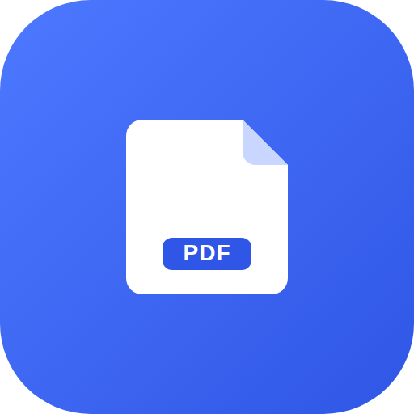

# Pocket PDF

A calm, private PDF reader that installs from the browser and turns any device
into a focused reading surface.

Open a PDF from your device and read it immediately in a clean, responsive
interface — **without uploading the document or creating an account**.

<p align="center"></p>

## Why

Built-in browser PDF viewers are functional but visually noisy, inconsistent
across devices, and not designed as a focused personal reading experience.
Pocket PDF gives the document nearly all of the screen and gets out of the way.

## Features

**Document**
- Open a local PDF through a file picker
- Drag & drop a PDF (desktop)
- One-page-at-a-time rendering with [PDF.js](https://mozilla.github.io/pdf.js/)
- Previous / next page navigation and direct page-number entry
- Zoom in / out and fit-to-width
- Rotate clockwise
- Fullscreen reading mode

**Experience**
- Responsive, mobile-first layout with large touch targets and bottom controls
- Keyboard shortcuts for navigation and zoom
- Visible loading and error states
- Remembers your theme, zoom preference, and the last page you read — per file
- Light and dark themes (follows the system by default)
- Install button when the browser exposes the PWA install event

**PWA**
- Web app manifest, standalone display mode, maskable icons
- Service worker caches the app shell for offline reopening after the first load

## Keyboard shortcuts

| Key | Action |
| --- | --- |
| `→` / `PageDown` / `Space` | Next page |
| `←` / `PageUp` | Previous page |
| `Home` / `End` | First / last page |
| `+` / `-` | Zoom in / out |
| `0` | Fit width |
| `R` | Rotate clockwise |
| `F` | Fullscreen |
| `T` | Toggle theme |
| `O` | Open a file |

## Privacy

- **No upload, no backend.** Selected PDFs are read directly in the browser.
- **Only preferences are stored** — theme, zoom, and last-page-per-filename live
  in `localStorage`. The document itself is never persisted, so you'll choose it
  again after a reload.
- **No third-party requests.** PDF.js is vendored locally under
  [`vendor/pdfjs`](vendor/pdfjs), so the app makes no CDN or external network
  calls and works fully offline once the shell is cached.

## Running locally

It's plain HTML/CSS/JS — no build step. Because it uses ES modules and a service
worker, serve it over HTTP rather than opening the file directly:

```bash
# any static server works, e.g.
python3 -m http.server 8080
# then visit http://localhost:8080
```

A service worker and PWA install require a **secure context** (`https://` or
`localhost`).

## Deploying

Deploy the folder to any HTTPS static host — GitHub Pages, Netlify, Vercel,
Azure Static Web Apps, or Cloudflare Pages. All paths are relative, so it works
from a subpath (e.g. a GitHub Pages project site).

## PDF.js runtime

The Mozilla PDF.js display build (`pdf.min.mjs` + `pdf.worker.min.mjs`, v4.7.76)
is vendored under [`vendor/pdfjs`](vendor/pdfjs) and loaded relative to
[`js/pdf-loader.js`](js/pdf-loader.js). To switch to a CDN build instead, point
`PDFJS_BASE` there — nothing else needs to change.

## Tech

Vanilla HTML, CSS, and JavaScript modules · self-hosted Mozilla PDF.js display
layer · no backend · in-memory document state plus `localStorage` preferences.

## Non-goals (v0.1)

Editing, annotations, text search, OCR, cloud storage or sync, accounts,
sharing, and signatures are intentionally out of scope — this is a focused
reader, not a PDF suite.
